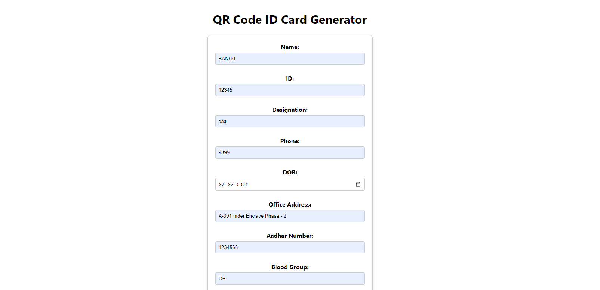
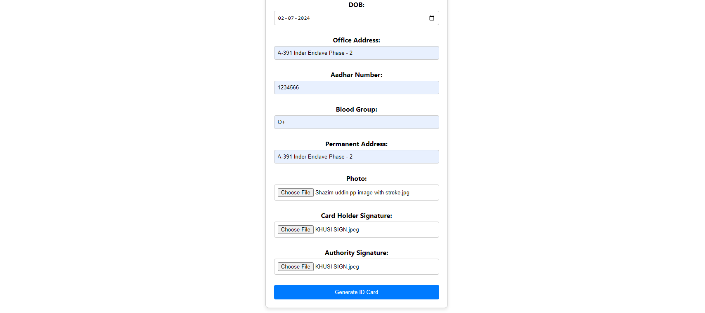
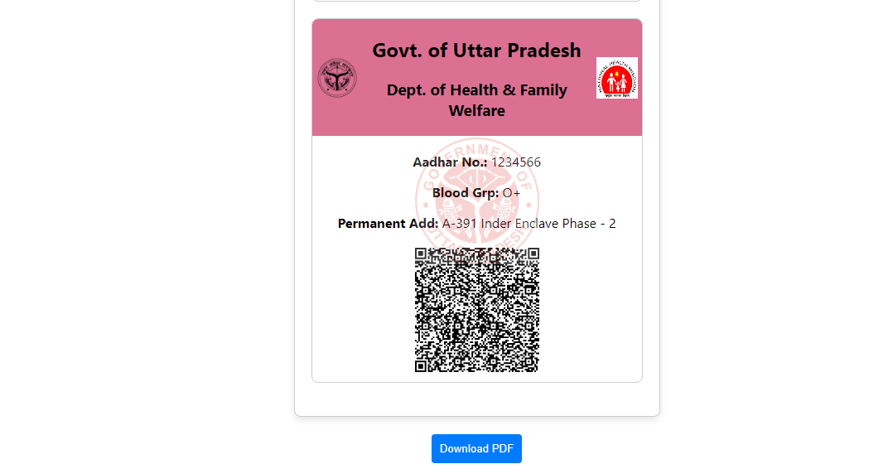

# ID Card with QR Code Generator

## Overview

This project is a web-based application developed using React JS for generating customizable ID cards with embedded QR codes. It’s designed for healthcare professionals, allowing the creation of ID cards with essential information such as name, ID, phone number, Aadhar number, date of birth (DOB), address and much more.

## Features

- **Customizable ID Cards**: Input and display personal details.
- **Embedded QR Codes**: QR codes are generated and included in the ID card for easy verification and access.
- **Professional Design**: Styled to present information clearly and professionally.

## Installation

To get started with this project, follow these steps:

1. **Clone the repository**:
    ```bash
    git clone https://github.com/yourusername/cmo-id-card-with-qr-code-generator.git
    ```

2. **Navigate to the project directory**:
    ```bash
    cd cmo-id-card-with-qr-code-generator
    ```

3. **Install dependencies**:
    ```bash
    npm install
    ```

4. **Start the development server**:
    ```bash
    npm start
    ```

   Open your browser and go to `http://localhost:3000` to view the application.

## Usage

1. **Enter Details**: Fill in the form fields with the required information including name, ID, phone number, Aadhar number, DOB, and address.
2. **Generate QR Code**: Click the button to generate the QR code and view the ID card.
3. **Download/Print**: The generated ID card can be downloaded or printed for use.

## Screenshots

### Homepage





The homepage where users can enter their details to generate the ID card.

### ID Card Preview


A preview of the generated ID card with the embedded QR code.

### Download Page



The page where users can download or print the generated ID card.

## Technologies Used

- **React JS**: Front-end framework for building the user interface.
- **QR Code Generator Library**: Used to create QR codes (e.g., `qrcode.react`).

## Contributing

Contributions are welcome! If you have suggestions or improvements, please open an issue or submit a pull request.

1. **Fork the repository**.
2. **Create a feature branch**:
    ```bash
    git checkout -b feature/YourFeatureName
    ```
3. **Commit your changes**:
    ```bash
    git commit -am 'Add new feature'
    ```
4. **Push to the branch**:
    ```bash
    git push origin feature/YourFeatureName
    ```
5. **Open a pull request**.

## License

This project is licensed under the MIT License. See the [LICENSE](LICENSE) file for details.

## Contact

For any questions or feedback, please reach out to [your-email@example.com](mailto:panditsanoj124@gmail.com).
